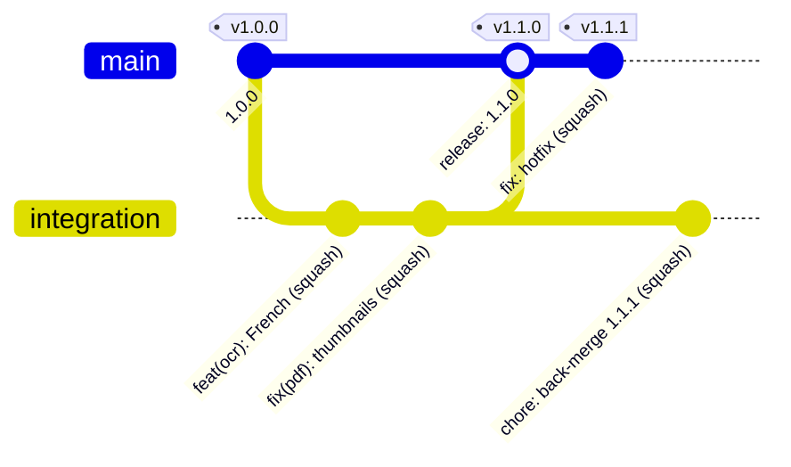

# Branching and merging

How a change travels from a work branch to the App Store: the two long-lived branches, how work
branches are named, which merge method each kind of pull request uses, how hotfixes reach
production and flow back, and why this repository departs from the organisation's default of a
single `main` branch for apps. It applies to people and coding agents alike; the rules it
summarises are enforced by the rulesets in [`.github/rulesets/`](../../.github/rulesets/) and the
jobs in [`ci.yml`](../../.github/workflows/ci.yml).

Owner: Release · Reviewed: each milestone, and whenever a ruleset or `ci.yml` changes

## The model

| Branch | Role | Receives changes from | Merge method | Builds and distribution |
|---|---|---|---|---|
| `integration` | Default branch; staging line | Work branches, through pull requests | Squash only (ruleset) | Xcode Cloud, Staging configuration → TestFlight internal |
| `main` | Production line | The release pull request from `integration`; `hotfix/*` branches | Merge commit (release); squash (hotfix) | Xcode Cloud, Release configuration → TestFlight external → App Store, phased release |
| `<type>/<description>` | One change | Its author | — | None; CI only |
| `hotfix/<description>` | One urgent production fix | Its author, branched from `main` | — | None; CI only |

Tags `vX.Y.Z` (and pre-release `vX.Y.Z-rc.N`) are created on `main` by the
[`release` workflow](../../.github/workflows/release.yml) after App Store approval; see
[release management](../release-management.md). Environments and build configurations are
described in [environments](environments.md).



## Work branches

- Branch from the latest `integration`, never from another work branch.
- Name the branch `<type>/<short-kebab-case-description>`, where `<type>` is one of `feat`, `fix`,
  `docs`, `chore`, `ci`, `refactor`, `perf` or `test` (for example `feat/ocr-language-picker`).
- `hotfix/<description>` is the only prefix that branches from `main`.
- Keep one change per pull request; for code, aim for fewer than 400 changed lines
  ([CONTRIBUTING](../../.github/CONTRIBUTING.md)).
- Branches are deleted automatically after merge (repository setting; see
  [repository standards](../repository-standards.md#settings-baseline)).

There are no long-lived release branches: the release pull request uses `integration` itself as its
head.

## Pull request titles

The `pr-title` job requires a [Conventional Commits](https://www.conventionalcommits.org/en/v1.0.0/)
title matching this pattern (from `ci.yml`):

```text
^(feat|fix|docs|chore|ci|refactor|perf|test|build|revert|release)(\([a-z0-9/-]+\))?!?: .+
```

Examples: `feat(ocr): add French recognition`, `fix(pdf)!: store annotations in the document`,
`release: 1.2.0`. The title becomes the squash commit on `integration` and is the raw material for
the changelog ([changelog strategy](../changelog-strategy.md)). The job re-runs when the title is
edited, so a failing title is fixed by editing it.

`build`, `revert` and `release` are pull request title types, not branch prefixes. That work sits on
a branch with one of the eight prefixes in [work branches](#work-branches) (for example a revert on
`fix/revert-save-conflict`), and the release pull request's head is `integration` itself.

## Merge methods

| Pull request | Base | Method | Why |
|---|---|---|---|
| Work branch | `integration` | Squash | One commit per change with a conventional title: a readable history and a clean changelog source. The `integration` ruleset allows only squash. |
| Release | `main` | Merge commit | `main` records exactly which `integration` commit shipped, and the individual changes stay visible in its history. |
| Hotfix | `main` | Squash | One commit per production fix on `main`. |
| Back-merge after a hotfix | `integration` | Squash | Brings the fix onto the staging line (see [hotfix flow](#hotfix-flow)). |

Rebase merging is disabled for the repository. The `main` ruleset allows both merge and squash,
because it must accept release and hotfix pull requests; choosing **Create a merge commit** for the
release pull request is therefore a checklist item for the Release hat rather than something the
ruleset can enforce. GitHub's merge methods are described in
[About merge methods on GitHub](https://docs.github.com/en/repositories/configuring-branches-and-merges-in-your-repository/configuring-pull-request-merges/about-merge-methods-on-github).

## The promotion guard

The `promotion-guard` job in `ci.yml` runs on every pull request. When the base is `main`, it fails
unless the head branch is `integration` (a release) or starts with `hotfix/` (a hotfix):

```text
Pull requests into main must come from integration (release) or hotfix/* (hotfix).
```

For pull requests into `integration` it passes and prints `ok: <head> -> <base>`. It is a required
check only in the `main` ruleset. If it fails, the pull request targets the wrong base: retarget it to
`integration`, or, if it really is an urgent production fix, recreate it from `main` as a
`hotfix/…` branch following the [hotfix runbook](runbooks/ios-hotfix.md).

## Hotfix flow

A hotfix fixes a production problem that cannot wait for the next release train. The full procedure,
including App Store steps, is the [iOS hotfix runbook](runbooks/ios-hotfix.md); the branch mechanics
are:

1. Branch `hotfix/<description>` from `origin/main`.
2. Make the smallest fix with a regression test, bump the patch version and add the CHANGELOG
   section for it.
3. Open a pull request into `main`; `promotion-guard` accepts the `hotfix/` prefix. Squash-merge it
   once every required check passes.
4. Back-merge: branch `chore/back-merge-X.Y.Z` from `origin/main`, open a pull request into
   `integration` and squash-merge it, so the staging line carries the fix. Resolve any conflict on
   that branch (merge `origin/integration` into it), never on `integration` directly.

A pull request whose head is `main` itself is avoided on purpose: the branch-deletion rule protects
`main`, but a dedicated back-merge branch keeps the automatic branch clean-up simple and lets
conflicts be resolved in a normal work branch.

## Keeping `integration` level with `main`

After every release merge commit, and after every hotfix, `main` holds commits that `integration`
does not contain as ancestors. A squash back-merge brings the *content* across but not the
*ancestry*. If `main` required pull requests to be up to date with it, every release pull request
after the first would be reported as out of date, and squash-only `integration` offers no way to
fix that without a bypass.

**Decision (recorded in ADR-0016).** The `main` ruleset requires every check to pass on the release
pull request's head (`strict_required_status_checks_policy: false`), without also requiring the
head to be up to date with `main`
([About rulesets](https://docs.github.com/en/repositories/configuring-branches-and-merges-in-your-repository/managing-rulesets/about-rulesets)).
Nothing untested ships, because:

1. the release pull request's head is `integration`, which every check has already run on;
2. content that exists only on `main` (hotfixes) is back-merged into `integration` before the next
   release pull request is opened;
3. the push to `main` runs `ci.yml` again on the merged result, Xcode Cloud builds `main` before any
   submission, and `release.yml` re-runs its gates on `main` before tagging.

Rejected: allowing merge commits on `integration` (invites merge commits on ordinary work), and
**Update branch** on the release pull request (works only through the organisation-admin bypass).

## Why this overrides the organisation default

The organisation standard is that apps use `main` only. This repository keeps a second long-lived
branch. The exception is recorded in ADR-0016 ([`docs/adr/0016-two-branch-model.md`](../adr/0016-two-branch-model.md)), in
[AGENTS.md](../../AGENTS.md) (hard rule 2) and in org decision D-023.

- **Rationale.** An iOS app cannot be rolled back once users have installed it (see
  [release management](../release-management.md#rolling-back-on-ios)). A staging line that is built
  for internal TestFlight gives every change a soak period on real devices before it is
  promoted, and the release pull request gives the Release hat one reviewable promotion point.
- **Trade-offs.** Two branches to keep in step; a back-merge after each hotfix; one more concept for
  newcomers than a single trunk.
- **Alternatives considered.** A single `main` with release tags (the organisation default): simpler,
  but every merge would become a production candidate with no staging soak. Short-lived
  `release/X.Y` branches: more ceremony than a solo maintainer needs, and still a back-merge.
- **Risks.** `integration` drifting from `main` (mitigated by the back-merge rule and by
  [keeping `integration` level with `main`](#keeping-integration-level-with-main)); a work branch opened against `main` by mistake (caught by `promotion-guard`).
- **Future scalability impact.** The model scales to several contributors without change: approvals
  switch on through the rulesets ([GitHub governance](../github-governance.md#pull-request-approvals)),
  and Xcode Cloud workflows stay keyed to the two branches.

## Worked examples

Start a change and open its pull request:

```sh
git switch integration && git pull --ff-only
git switch -c feat/ocr-language-picker integration
# edit, commit, and update CHANGELOG [Unreleased] if users will notice the change
git push -u origin feat/ocr-language-picker
gh pr create --base integration --title "feat(ocr): add a language picker" --fill
gh pr checks --watch
```

Merge it (maintainer only, once every required check is green):

```sh
gh pr merge --squash --delete-branch
```

Open and merge a release pull request (Release hat; see [release management](../release-management.md)):

```sh
gh pr create --base main --head integration --title "release: 1.2.0" --body-file release-pr.md
gh pr merge <number> --merge        # a merge commit; never pass --delete-branch here
```

Ship a hotfix and back-merge it:

```sh
git fetch origin
git switch -c hotfix/crash-opening-encrypted-pdf origin/main
# fix, test, bump the patch version, add the CHANGELOG section
gh pr create --base main --title "fix(pdf): crash when opening encrypted files" --fill
gh pr merge --squash --delete-branch

git fetch origin
git switch -c chore/back-merge-1.2.1 origin/main
git push -u origin chore/back-merge-1.2.1
gh pr create --base integration --title "chore: back-merge 1.2.1 into integration" --fill
```

Coding agents may create branches and open pull requests; merging, and anything that touches
`main`, needs the maintainer ([SUPERVISION.md](../../.github/SUPERVISION.md)).
